# Audio NLP Processing Pipeline

A multimodal inference pipeline that ingests heterogeneous audio sources — streaming URLs or raw file uploads — and transforms unstructured acoustic signal into structured, queryable knowledge through automatic speech recognition, comparative abstractive summarization, and retrieval-grounded generative question answering.

---

## Problem Statement

Long-form audio — podcasts, lectures, recorded interviews — encodes high-value information inside an inherently low-bandwidth modality: continuous speech. Extracting or verifying a single fact demands linear traversal of the entire recording; there is no random-access mechanism into spoken content. Naive summarization tools compound this problem by collapsing the source into a single unverifiable text artifact, severing the link between claim and evidence and foreclosing any follow-up interrogation of the material.

## Solution

This system decouples acquisition, transcription, and reasoning into independent, composable stages and exposes three capabilities against any ingested source:

- **Automatic transcription** — speech is decoded into text via a transformer-based acoustic model, with existing transcripts short-circuited when available to avoid redundant computation.
- **Comparative abstractive summarization** — two architecturally distinct transformer models process identical input in parallel and are benchmarked against quantitative metrics rather than judged subjectively.
- **Retrieval-augmented generative Q&A** — natural language queries are answered by an LLM conditioned exclusively on semantically retrieved transcript passages, constraining generation to grounded evidence and suppressing hallucination.
- **Speech synthesis** — generated summaries and answers can be rendered back into spoken audio via Google Text-to-Speech (gTTS), closing the loop from audio input to audio output.

---

## Architecture

```mermaid
---
config:
  layout: fixed
---
flowchart LR
    %% Subgraph 1: Inputs
    subgraph Inputs ["1. Input Sources"]
        direction TB
        A["YouTube URL"]
        B["Audio File Upload"]
    end

    %% Subgraph 2: Transcription Pipeline
    subgraph Transcription ["2. Audio & Transcription"]
        direction TB
        C{"Transcript<br>Available?"}
        D["Use Existing Transcript"]
        E["Download Audio"]
        F["Normalize Audio<br>ffmpeg, 16kHz mono"]
        G["Whisper ASR<br>Speech-to-Text"]
        H["Final Transcript"]
        
        A --> C
        C -- Yes --> D
        C -- No --> E
        B --> F
        E --> F
        F --> G
        D --> H
        G --> H
    end

    %% Subgraph 3: Processing & Routing
    subgraph Processing ["3. Chunking & Routing"]
        I["Chunk Transcript<br>Token-aware Segmentation"]
        O["Split into Overlapping Chunks<br>350 words, 60 overlap"]
        
        H --> I
        H --> O
    end

    %% Subgraph 4: Summarization Track
    subgraph Summarization ["4. Summarization Models"]
        direction TB
        J["BART-large-CNN"]
        K["T5-base"]
        L["Summary - BART<br>Abstractive, Higher Accuracy"]
        M["Summary - T5<br>Abstractive, Higher Compression"]
        N["Model Comparison Tab<br>Time, Compression, Quality"]
        
        I --> J & K
        J --> L
        K --> M
        L --> N
        M --> N
    end

    %% Subgraph 5: RAG Track
    subgraph RAG ["5. RAG & QA Pipeline"]
        direction TB
        P["SentenceTransformer Embeddings<br>all-MiniLM-L6-v2"]
        Q[("FAISS Vector Index")]
        R["User Question"]
        S["Query Embedding"]
        T["FAISS Similarity Search<br>Top-K Retrieval"]
        U["Context Construction"]
        V["Groq Llama 3.3 70B"]
        W["Final Answer"]
        
        O --> P --> Q
        R --> S --> T
        Q --> T
        T --> U --> V --> W
    end

    %% UI Output
    X(("Streamlit UI<br>Transcript / Summary / Comparison / Q&amp;A"))

    %% Connect tracks to UI
    N --> X
    W --> X
    H --> X
```



---

## Multimodal Architecture

The pipeline fuses two distinct modalities — raw acoustic signal and derived natural-language text — into a single reasoning substrate. Audio is decoded through a mel-spectrogram-driven encoder-decoder transformer (Whisper) and projected into UTF-8 text; that text is subsequently re-encoded into dense vector space via a Sentence-Transformer model for semantic retrieval, and independently routed into sequence-to-sequence summarization models. The system therefore executes three distinct model families across two modalities — acoustic-to-text, text-to-text summarization, and text-to-vector embedding — and reconciles their outputs behind a unified interface, rather than treating audio as a single-purpose input to one downstream model.

## Data Acquisition Layer

Acquisition is engineered as a fault-tolerant, source-agnostic front end rather than a thin file-loader:

- **Dual-pathway ingestion** — a streaming extractor (`yt-dlp`) resolves and downloads audio directly from URLs, while a parallel binary-upload path accepts arbitrary local files; both converge into a single normalization contract.
- **Transcript short-circuiting** — where a platform-native transcript already exists, the pipeline bypasses ASR entirely, eliminating unnecessary GPU/CPU cycles and reducing end-to-end latency.
- **Format normalization** — heterogeneous containers (`.mp3`, `.mp4`, `.wav`, `.m4a`, `.webm`, `.ogg`) are coerced through `ffmpeg` into a canonical 16 kHz mono float32 PCM representation, guaranteeing a deterministic input contract for the ASR stage regardless of source codec or sample rate.
- **Stateless, cache-isolated execution** — intermediate audio artifacts are staged through a configurable temporary cache directory, decoupling ingestion throughput from downstream model inference and permitting horizontal scaling of the acquisition tier independent of the modeling tier.

## Technical Highlights

<<<<<<< HEAD
**Key parameters:**
- Output format: 16000 Hz sample rate, mono channel, float32 PCM
- Temporary cache path: configurable via environment variable `AUDIO_CACHE_DIR`
- Supported input containers: `.mp3`, `.mp4`, `.wav`, `.m4a`, `.webm`, `.ogg`

---

### 2. Speech Recognition Engine

Speech-to-text inference is performed by **OpenAI Whisper (base variant)**. The engine operates on fixed-length 30-second audio windows and uses a hybrid encoder-decoder architecture based on the transformer attention mechanism.

```
+---------------------------+
|  Float32 PCM Audio Buffer |
|  (16kHz, mono)            |
+-----------+---------------+
            |
            v
+-----------+---------------+
|  Log-Mel Spectrogram      |
|  Extraction               |
|  - FFT window: 25ms       |
|  - Hop length: 10ms       |
|  - n_mels: 80             |
+-----------+---------------+
            |
            v
+-----------+---------------+
|  Convolutional Feature    |
|  Encoder (2 x Conv1D)     |
|  + GELU activations       |
+-----------+---------------+
            |
            v
+-----------+---------------+
|  Transformer Encoder      |
|  - 6 attention heads      |
|  - 512-dim hidden states  |
|  - Positional embedding   |
+-----------+---------------+
            |
            v
+-----------+---------------+
|  Autoregressive Decoder   |
|  - Cross-attention over   |
|    encoder output         |
|  - Greedy / beam search   |
|  - BPE tokenizer (50k)    |
+-----------+---------------+
            |
            v
+-----------+---------------+
|  UTF-8 Text Transcript    |
|  (with punctuation,       |
|   capitalization,         |
|   timestamp tokens opt.)  |
+---------------------------+
```

The base model contains approximately 74M parameters and supports multilingual transcription. Language detection is performed on the first 30-second window via log-probability distribution over the language token vocabulary.

---

### 3. Text Segmentation and Chunking

Transformer summarization models impose a maximum context window constraint (typically 1024 tokens for BART, 512 tokens for T5). The segmentation module breaks the raw transcript into overlapping chunks that respect these limits while preserving semantic boundaries.

```
+-----------------------------------+
|  Raw Transcript                   |
|  (variable-length UTF-8 string)   |
+-----------------+-----------------+
                  |
                  v
+-----------------+-----------------+
|  Sentence Boundary Detection      |
|  (spaCy / rule-based tokenizer)   |
+-----------------+-----------------+
                  |
                  v
+-----------------+-----------------+
|  Tokenization via HuggingFace     |
|  AutoTokenizer for target model   |
|  -> token ID sequences            |
+-----------------+-----------------+
                  |
                  v
+-----------------+-----------------+
|  Sliding Window Chunker           |
|  - max_length: model-dependent    |
|    BART: 1024 tokens              |
|    T5:    512 tokens              |
|  - stride / overlap: configurable |
|  - Boundary-aware split           |
|    (avoids mid-sentence cuts)     |
+-----------------+-----------------+
                  |
         +--------+--------+
         |        |        |
         v        v        v
      +-----+  +-----+  +-----+
      | Seg |  | Seg |  | Seg |
      |  1  |  |  2  |  |  N  |
      +-----+  +-----+  +-----+
         |        |        |
         +--------+--------+
                  |
                  v
+------------------+----------------+
|  Chunk Iterator -> Inference Hub  |
+-----------------------------------+
```

Chunk metadata includes token count, character offset range, and sentence boundary indices to support post-hoc alignment of summaries back to source segments.

---

### 4. Summarization Pipeline

Each text chunk is independently passed through the selected transformer model. Per-chunk summaries are concatenated and optionally subjected to a second-pass summarization if the combined output exceeds the model's input limit.

```
+------------------------------------------+
|  Segmented Chunk [i]                     |
|  (token-bounded, boundary-aligned)       |
+--------------+---------------------------+
               |
      +--------+--------+
      |                 |
      v                 v
+-----+------+   +------+------+
|  BART-large |   |  T5-base    |
|  -CNN       |   |             |
|  406M params|   |  220M params|
|             |   |             |
|  Encoder:   |   |  Encoder:   |
|  12 layers  |   |  6 layers   |
|  1024 hidden|   |  768 hidden |
|             |   |             |
|  Decoder:   |   |  Decoder:   |
|  12 layers  |   |  6 layers   |
|  cross-attn |   |  cross-attn |
|             |   |             |
|  Beam search|   |  Greedy /   |
|  num_beams=4|   |  beam=2     |
|             |   |             |
|  max_new_   |   |  max_new_   |
|  tokens=150 |   |  tokens=100 |
+-----+------+   +------+------+
      |                 |
      v                 v
+-----+------+   +------+------+
| Chunk Sum. |   | Chunk Sum.  |
|  BART [i]  |   |   T5 [i]    |
+-----+------+   +------+------+
      |                 |
      v                 v
+-----+------+   +------+------+
| Concatenate|   | Concatenate |
| all chunks |   | all chunks  |
+-----+------+   +------+------+
      |                 |
      v                 v
+-----+------+   +------+-----+
| Final BART |   | Final T5   |
| Summary    |   | Summary    |
| output     |   | output     |
+------------+   +------------+
      |                 |
      +--------+--------+
               |
               v
+-----------------------------+
|  Compression Metrics        |
|  - Input char count         |
|  - Output char count        |
|  - Compression ratio (%)    |
|  - Inference latency (s)    |
|  - Sentence count delta     |
+-----------------------------+
```

**BART-large-CNN:** Fine-tuned on CNN/DailyMail news summarization. Favors extractive-leaning abstractive output with high lexical fidelity. Compression ratio: 60-75%.

**T5-base:** Fine-tuned on C4 with summarization prefix prompting ("summarize: ..."). Produces highly abstractive, compressed output. Compression ratio: 85-95%.

---

### 5. Retrieval-Augmented Generation (RAG)

The RAG subsystem indexes the full transcript into a FAISS vector store and supports natural language querying. Relevant passages are retrieved by L2 distance and injected as context into **Llama 3.3 70B** served via the **Groq API** for low-latency answer synthesis. The Groq client is initialized using the OpenAI-compatible SDK pointed at `https://api.groq.com/openai/v1`, with the `GROQ_API_KEY` loaded from `.env` via `python-dotenv`.

```
                    INDEXING PHASE (run once per transcript)
+--------------------------------------------+
|  Full Transcript Buffer                    |
+-------------------+------------------------+
                    |
                    v
+-------------------+------------------------+
|  Word-based Text Splitter                  |
|  (src.processing.chunking.split_text)      |
|  - max_words: 350 per chunk                |
|  - overlap:    60 words between chunks     |
|  Custom Boundary-Aware Text Splitter       |
|  - max_words: 350 per chunk                |
|  - overlap: 60 words                       |
+-------------------+------------------------+
                    |
          +---------+---------+
          |         |         |
          v         v         v
       +------+  +------+  +------+
       | Chunk|  | Chunk|  | Chunk|
       |  1   |  |  2   |  |  N   |
       +--+---+  +--+---+  +--+---+
          |         |         |
          v         v         v
+--------------------------------------------+
|  SentenceTransformer Embedding Model       |
|  Model: all-MiniLM-L6-v2 (lazy-loaded)     |
|  Output: 384-dim float32 numpy vectors     |
+-------------------+------------------------+
                    |
                    v
+-------------------+------------------------+
|  FAISS IndexFlatL2                         |
|  (Euclidean / L2 distance, flat index)     |
|  In-memory, no quantization                |
|  ntotal = number of transcript chunks      |
+--------------------------------------------+


                    QUERY PHASE (per user question)
+--------------------------------------------+
|  User Natural Language Question            |
+-------------------+------------------------+
                    |
                    v
+-------------------+------------------------+
|  Query Embedding                           |
|  (same all-MiniLM-L6-v2 encoder)           |
|  Output: 384-dim float32 query vector      |
+-------------------+------------------------+
                    |
                    v
+-------------------+------------------------+
|  FAISS index.search()                      |
|  - top_k = 4 (answer generation)           |
|  - top_k = 5 (search_transcript())         |
|  Returns: distances[], indices[]           |
|  Relevance score = 1 / (1 + L2_distance)   |
+-------------------+------------------------+
                    |
                    v
+-------------------+------------------------+
|  Context Construction                      |
|  - top_k chunks joined with newline        |
|  - Each chunk carries distance + index     |
+-------------------+------------------------+
                    |
                    v
+-------------------+------------------------+
|  Groq API  (OpenAI-compatible endpoint)    |
|  base_url: https://api.groq.com/openai/v1  |
|  model:    llama-3.3-70b-versatile         |
|  temperature: 0.3                          |
|                                            |
|  System prompt:                            |
|  "Answer from podcast transcript context   |
|   only. If not found, say 'Not found'.     |
|   Keep answers concise."                   |
|                                            |
|  User prompt:                              |
|  Context: {retrieved_chunks}               |
|  Question: {user_question}                 |
|  Generative Answer Synthesis               |
|  (Llama-3.3-70b via Groq API)              |
|  Input: [context] + [question]             |
|  Output: free-form answer string           |
+-------------------+------------------------+
                    |
                    v
+-------------------+------------------------+
|  Final Q&A Response                        |
|  (response.choices[0].message.content)     |
+--------------------------------------------+
```

**Environment variable required:**

```
GROQ_API_KEY=your_groq_api_key_here
```

Stored in a `.env` file at the project root. Loaded automatically at module import via `python-dotenv`.

---

## Data Flow Diagram

The following represents the complete end-to-end data flow from raw media input to structured output across all subsystems.

```
Raw Media Input
(YouTube URL or Binary Upload)
           |
           v
    [Validation Layer]
     URL parsing / MIME
           |
           v
   [yt-dlp / File Buffer]
     Audio stream download
     or in-memory read
           |
           v
   [Format Normalization]
     ffmpeg -> 16kHz mono
     float32 PCM array
           |
           v
   [Whisper STT Engine]
     Mel spectrogram
     Encoder-decoder attn
     BPE tokenization
           |
           v
   [Raw UTF-8 Transcript]
     Full text string
     (variable length)
           |
     +-----+-----+
     |           |
     v           v
[Chunker]   [Text Splitter]
Token-aware  Char-overlap
segmentation  for FAISS
     |           |
     v           v
[BART / T5] [Embedder]
Inference   Dense vectors
     |           |
     v           v
[Summaries] [FAISS Index]
+ metrics        |
                 v
            [User Query]
                 |
                 v
           [Similarity Search]
           top-k retrieval
                 |
                 v
           [QA Generator]
           context injection
                 |
                 v
           [Q&A Response]
```

---
=======
- **Native ASR implementation** — audio is decoded through Whisper's convolutional feature encoder and autoregressive cross-attention decoder, not delegated to a third-party transcription API.
- **Empirical model benchmarking** — BART-large-CNN and T5-base are evaluated head-to-head on identical input, quantified via compression ratio, wall-clock inference latency, and sentence-count delta, yielding a reproducible comparative framework rather than a single opaque output.
- **Evidence-grounded generation** — FAISS-indexed dense retrieval constrains the LLM's context window to top-k semantically relevant passages before invoking Llama 3.3 70B via Groq, architecturally suppressing unconstrained hallucination.
- **Production-grade engineering discipline** — externalized configuration (`.env` / `config.py`), a pytest suite with fully mocked external dependencies, coverage instrumentation, static linting, and a GitHub Actions CI pipeline gating every commit.
>>>>>>> b8462dd (updated readme)

## Comparative Model Analysis

Both BART-large-CNN and T5-base are **abstractive** summarizers: they generate novel phrasing conditioned on the source text rather than performing **extractive** summarization, which would simply select and concatenate existing sentences verbatim. This distinction matters — abstractive models can compress and rephrase for readability but carry higher risk of paraphrastic drift, which is precisely why the pipeline benchmarks them empirically rather than trusting either output blindly.

| Property | BART-large-CNN | T5-base |
|---|---|---|
| Parameters | 406M | 220M |
| Summarization type | Abstractive (extractive-leaning, high lexical fidelity) | Abstractive (highly compressive, aggressive rephrasing) |
| Fine-tuning corpus | CNN / DailyMail | C4 with summarization prefix prompting |
| Max input tokens | 1024 | 512 |
| Compression ratio | 60-75% | 85-95% |
| Decoding strategy | Beam search (num_beams=4) | Greedy / beam (num_beams=2) |

The application surfaces this comparison directly in a dedicated **Model Comparison** view, reporting compression ratio, inference latency, and sentence-count delta side by side for the same input — turning model selection into a data-driven decision rather than a fixed default.

## Research Gap

The majority of transcript-summarization systems commit to a single model and treat its output as ground truth, obscuring the compression-versus-fidelity-versus-latency trade-off inherent to abstractive summarization. This pipeline instead instruments two architecturally divergent models under identical experimental conditions, exposing that trade-off empirically rather than asserting it. Layering a retrieval-grounded Q&A subsystem atop this comparative framework further demonstrates a hybrid reasoning strategy — abstractive compression for global context, dense retrieval for verifiable, localized fact recovery — rather than overloading a single paradigm to serve both objectives.

---

## Tech Stack

| Layer | Components |
|---|---|
| Interface | Streamlit |
| Acquisition | yt-dlp, ffmpeg |
| Speech-to-text | OpenAI Whisper (encoder-decoder transformer) |
| Summarization | BART-large-CNN, T5-base (HuggingFace Transformers) |
| Retrieval / Generation | Sentence-Transformers, FAISS, Groq API (Llama 3.3 70B) |
| Speech synthesis | gTTS (Google Text-to-Speech) |
| Testing / CI | pytest, pytest-cov, flake8, GitHub Actions |

---

## Project Structure

```
audio-nlp-processing-pipeline/
<<<<<<< HEAD
├── app/
│   ├── app.py              # Streamlit UI with 5 tabs
│   ├── __init__.py
│   └── style.css           # Custom styling
├── src/
│   ├── pipeline.py         # Main orchestration (facades)
│   ├── ingestion/
│   │   ├── youtube.py      # YouTube extraction & audio download
│   │   ├── transcribe.py   # Whisper transcription
│   │   └── __init__.py
│   ├── processing/
│   │   ├── summarize.py    # BART & T5 summarization
│   │   ├── chunking.py     # Text segmentation
│   │   ├── tts.py          # Text-to-speech
│   │   └── __init__.py
│   └── retrieval/
│       ├── rag.py          # RAG with FAISS & Groq LLM
│       └── __init__.py
├── tests/                   # Pytest suite
├── config.py               # Centralized configuration
├── requirements.txt        # Dependencies
├── runtime.txt             # Python version
└── .github/workflows/
    └── ci.yml              # GitHub Actions CI
=======
├── .github/
│   └── workflows/               # GitHub Actions CI pipeline (test + lint on push/PR)
├── app/
│   └── app.py                   # Streamlit entry point and UI orchestration
├── src/
│   ├── ingestion/
│   │   ├── youtube.py           # yt-dlp extraction, transcript short-circuiting
│   │   └── transcribe.py        # Whisper ASR implementation
│   ├── processing/
│   │   ├── chunking.py          # Token-aware and word-based text splitters
│   │   └── summarize.py         # BART / T5 abstractive summarization pipelines
│   └── retrieval/
│       └── rag.py               # FAISS indexing, retrieval, Groq-based QA synthesis
├── tests/
│   ├── test_chunking.py
│   ├── test_ingestion.py
│   └── test_rag.py
├── config.py                    # Centralized configuration (models, tokens, thresholds)
├── requirements.txt              # Pinned dependencies
├── runtime.txt                   # Python runtime specifier
├── pytest.ini                    # Test discovery and coverage configuration
├── .env                          # Local secrets (GROQ_API_KEY) — not committed
└── README.md
>>>>>>> b8462dd (updated readme)
```

---

## Setup

```bash
git clone https://github.com/shravan606756/audio-nlp-processing-pipeline.git
cd audio-nlp-processing-pipeline
python3.10 -m venv venv && source venv/bin/activate
pip install -r requirements.txt
echo "GROQ_API_KEY=your_key_here" > .env
streamlit run app/app.py
```

Requirements: Python 3.10+, `ffmpeg` on system PATH, and a Groq API key for Q&A functionality.

---

## Testing

```bash
pytest --cov=src --cov-report=term-missing
```

The suite mocks all external dependencies (Whisper, HuggingFace pipelines, yt-dlp, FAISS) and executes automatically via CI on every push and pull request.

---

## License

See `LICENSE` for terms of use and distribution.
